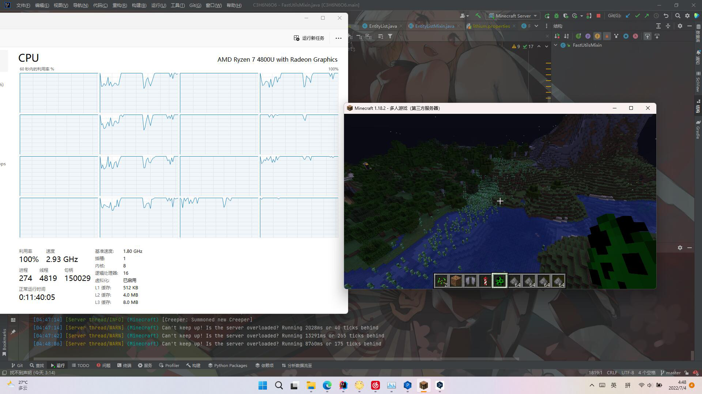

# 环三亚甲基三硝胺 Cyclotrimethylenetrinitramine (C3H6N6O6)

ps:你可以叫它黑索金 | You can call it Cyclonite.

这是一个用于实体多线程运算的模组，适用于Minecraft1.18.2 Fabric。
它与大多数模组兼容，与锂兼容需要关闭锂的entity和collections

This is a module for entity multithreading for Minecraft 1.18.2 Fabric.
It is compatible with most modules, compatibility with lithium requires turning off lithium's ENTITY and COLLECTIONS

**它与C2ME完全兼容**

**It is fully compatible with C2ME**

使用效果 | Usage results：

### 特别鸣谢 Special Thanks
这个项目的原理来自MCMTFabric，在此特别感谢MCMT的工作。

The rationale for this project comes from MCMTFabric, and a special thanks to MCMT for their work.